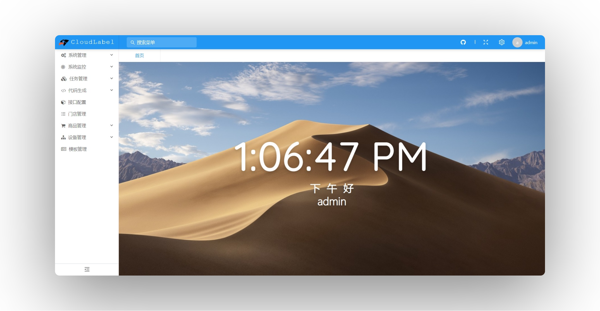

<h1 align="center">Cloud Label</h1>
<h3 align="center">一站式电子标签云管理平台</h3>

---

<p align="center">
    <a href="https://www.erupt.xyz" target="_blank"></a>
    <a href="https://github.com/erupts/erupt" target="_blank"></a>
    <a></a>
    <a href="./LICENSE"></a>

</p>

---

## 简介 | Intro

物联网应用——电子标签设备管理平台

不限于商超、会议、仓管、医院等环境和用途

本项目为数据库课程设计作业 ，以商超情景电子价签管理为例，包名为 `esl`

> 主要功能：
>
> - 系统维护（Erupt Framework 提供，包括用户维护、组织维护、日志等）
>
> - 门店管理
>
> - 商品管理（商品分类和商品列表）
>
> - 设备管理（基站管理和价签管理）
>
> - 模板管理

只完成 CRUD 部分，未编写接口，仅供学习

## 截图 | Screenshots





## 技术栈 | Tech Stack

- [Erupt Framework 通用后台管理框架](https://www.erupt.xyz)

- Spring Boot 2.4.1

- Spring Data JPA

- Hibernate

- [NG-ALAIN](https://ng-alain.com/)

- MySQL 8.0

- Redis 6.0

- Docker

- ...

## 使用方法 | Usage

> 推荐使用 MySQL 8.0+ 运行本项目，必须 JDK 1.8+

1. 下载代码，或者执行：

```
git clone https://github.com/microlong666/Cloud-Label.git
```

2. 数据库中建立 `cloud_label` 库，可按需求启用 Redis

3. 创建 `application-dev.yml`，或在 `application.yml` 中补充：

``` yml
# 开发环境
spring:
  application:
    name: cloudLabel
  profiles:
    active: dev
  datasource:
    # 数据库驱动
    driver-class-name: com.mysql.cj.jdbc.Driver
    url: jdbc:mysql://localhost:3306/cloud_label?useUnicode=true&characterEncoding=UTF-8&serverTimezone=Asia/Shanghai
    username: root
    password: 123456
  redis:
    host: localhost
    port: 6379
    timeout: 20000
  jpa:
    show-sql: true
    generate-ddl: true
    database-platform: org.hibernate.dialect.MySQL5InnoDBDialect
    database: mysql
  mail:
    username: xxxx@qq.com
    password: xxxxxxx
    host: smtp.qq.com
    properties:
      mail.smtp.ssl.auth: true
      mail.smtp.ssl.enable: true
      mail.smtp.ssl.required: true

server:
  # 启用 gzip 压缩
  compression:
    mime-types: application/javascript,text/css,application/json,application/xml,text/html,text/xml,text/plain
    enabled: true
  error:
    includeException: true
    includeStacktrace: ALWAYS
    includeMessage: ALWAYS
  port: 8888

erupt-app:
  # 登录失败几次，需要验证码
  verifyCodeCount: 2

erupt:
  # 是否开启csrf防御
  csrfInspect: true
  # 是否开启redis方式存储session，默认false，开启后需在配置文件中添加redis配置
  redisSession: false
  # 附件上传存储路径, 默认路径为：/opt/cloud-label
  uploadPath: D:\\
  # 是否保留上传文件原始名称
  keepUploadFileName: false
  # 登录session时长（redisSession为true时有效）
  upms.expireTimeByLogin: 60
  # 是否记录操作日志，默认true，该功能开启后可在【系统管理 → 操作日志】中查看操作日志
  security.recordOperateLog: true
```

**请修改上述数据源配置**

4. 同步 Maven 依赖后，直接运行 Spring Boot 应用，数据表和数据项将由 Hibernate 自动注入

5. 需要手动添加相关菜单项，提前导入项目根目录下的 `cloud_label.sql` 脚本

6. 打开浏览器，[http://localhost:8888](http://localhost:8888)，初始用户名和密码均为 `erupt`

7. 如需使用 Ant-Design-Vue 或 Element-UI-Vue 模板，请在 `pom.xml` 添加下列依赖：

``` xml
<!--Ant-Design-Vue-->
<dependency>
  <groupId>xyz.erupt</groupId>
  <artifactId>erupt-tpl-ui.ant-design</artifactId>
  <version>${erupt.version}</version>
</dependency>

<!--Element-UI-Vue-->
<dependency>
  <groupId>xyz.erupt</groupId>
  <artifactId>erupt-tpl-ui.element-ui</artifactId>
  <version>${erupt.version}</version>
</dependency>
```

## 部署方法 | Deploy

- Maven 打包成 `jar` 直接运行

- 提供 `Dockerfile` 文件，支持 Docker 远程部署。

## 版本说明 | Version

**1.0**

- 提升用户体验

- 修改关系逻辑

- 修复字段启用排序引发的错误

- 附加 sql 脚本，初始化时补全菜单项

- Erupt Framework 更新到 1.6.7

- 将表格项的删除操作替换为逻辑删除

## 已知问题 | Known issues

- 夜间模式与路由复用冲突

- 夜间模式下首页显示异常

- 待补充...